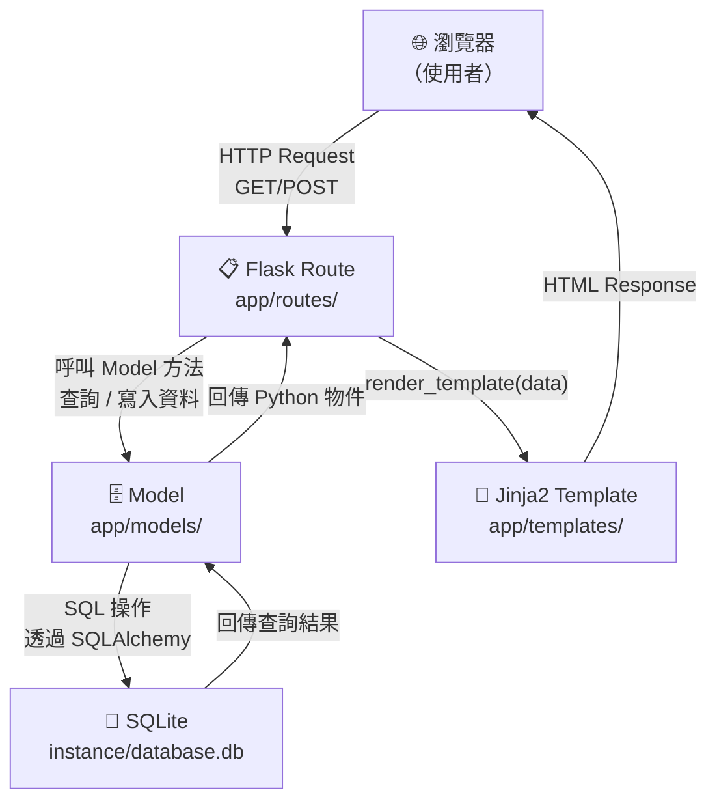
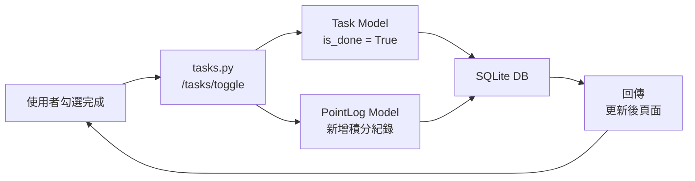

# 系統架構文件（ARCHITECTURE）

**專案名稱**：TaskFlow — 個人任務管理系統
**文件版本**：v1.0
**建立日期**：2026-04-15
**參考文件**：`docs/PRD.md`

---

## 1. 技術架構說明

### 1.1 選用技術與原因

| 技術 | 用途 | 選用原因 |
|------|------|----------|
| **Python 3** | 主要開發語言 | 語法簡潔，適合初學者，生態豐富 |
| **Flask** | Web 後端框架 | 輕量、靈活，適合小型專題，學習曲線低 |
| **Jinja2** | HTML 模板引擎 | Flask 內建，支援模板繼承，減少重複 HTML |
| **SQLAlchemy** | ORM（資料庫存取層） | 防止 SQL Injection，程式碼更易讀維護 |
| **SQLite** | 關聯式資料庫 | 無需安裝伺服器，資料存為單一檔案，部署零門檻 |
| **Vanilla CSS** | 頁面樣式 | 無需學習額外框架，完全掌控設計細節 |

### 1.2 Flask MVC 模式說明

本專案採用 **MVC（Model-View-Controller）** 架構模式：

```
Model      → app/models/        負責資料結構定義與資料庫操作
View       → app/templates/     負責 HTML 頁面渲染（Jinja2 模板）
Controller → app/routes/        負責接收請求、處理邏輯、回傳結果
```

| 層級 | 職責 | 範例 |
|------|------|------|
| **Model** | 定義資料表結構，提供 CRUD 方法 | `Task` 模型、`PointLog` 模型 |
| **View** | 根據資料渲染 HTML，不包含業務邏輯 | `index.html`、`edit.html` |
| **Controller** | 處理 HTTP 請求，呼叫 Model，選擇 View | `tasks.py` 路由群組 |

---

## 2. 專案資料夾結構

```
web_app_development/          ← 專案根目錄
│
├── app/                      ← Flask 應用程式主體
│   │
│   ├── __init__.py           ← 建立 Flask app 實例、註冊藍圖、初始化 DB
│   │
│   ├── models/               ← 資料庫模型（Model 層）
│   │   ├── __init__.py
│   │   ├── task.py           ← Task 資料表模型（任務 CRUD）
│   │   └── point_log.py      ← PointLog 資料表模型（積分歷程）
│   │
│   ├── routes/               ← Flask 路由（Controller 層）
│   │   ├── __init__.py
│   │   ├── tasks.py          ← 任務相關路由（新增、編輯、刪除、完成）
│   │   └── points.py         ← 積分歷程相關路由
│   │
│   ├── templates/            ← Jinja2 HTML 模板（View 層）
│   │   ├── base.html         ← 基底模板（導覽列、共用樣式）
│   │   ├── index.html        ← 首頁（任務清單 + 總積分）
│   │   ├── edit.html         ← 編輯任務頁面
│   │   └── point_log.html    ← 積分歷程頁面
│   │
│   └── static/               ← 靜態資源
│       ├── css/
│       │   └── style.css     ← 主要樣式表
│       └── js/
│           └── main.js       ← 前端互動邏輯（刪除確認、即時更新等）
│
├── instance/                 ← 執行時期產生的資料（不進版本控制）
│   └── database.db           ← SQLite 資料庫檔案
│
├── docs/                     ← 專案文件
│   ├── PRD.md                ← 產品需求文件
│   └── ARCHITECTURE.md       ← 本架構文件
│
├── app.py                    ← 應用程式入口點（啟動 Flask）
├── requirements.txt          ← Python 套件清單
└── .gitignore                ← 忽略 instance/、__pycache__/ 等
```

---

## 3. 元件關係圖

### 3.1 請求處理流程



### 3.2 積分系統資料流



---

## 4. 關鍵設計決策

### 決策 1：使用 Flask Blueprint 拆分路由

**問題**：所有路由若集中在 `app.py`，程式碼會隨功能增加而難以維護。

**決策**：將任務路由（`tasks.py`）與積分路由（`points.py`）拆成獨立 Blueprint 模組，再於 `app/__init__.py` 統一註冊。

**好處**：各模組職責清晰，未來新增功能（如使用者登入）只需新增一個 Blueprint。

---

### 決策 2：使用 SQLAlchemy ORM 而非直接 sqlite3

**問題**：直接撰寫 SQL 字串容易有 SQL Injection 風險，且程式碼可讀性低。

**決策**：採用 Flask-SQLAlchemy，以 Python 類別定義資料表，透過 ORM 方法操作資料。

**好處**：安全性高、程式碼直覺易讀，且未來若需要換資料庫（如 PostgreSQL）成本極低。

---

### 決策 3：Jinja2 模板繼承（Template Inheritance）

**問題**：每個頁面都需要重複的 `<head>`、導覽列等 HTML 骨架。

**決策**：建立 `base.html` 作為父模板，所有子頁面（`index.html`、`edit.html` 等）透過 `` 繼承。

**好處**：修改導覽列或全域樣式只需改一處，維護成本大幅降低。

---

### 決策 4：積分採用獨立 `PointLog` 資料表紀錄

**問題**：若只在 `Task` 上記錄總積分，取消完成後積分計算複雜，且無歷程可查。

**決策**：建立 `PointLog` 資料表，每次積分變動（+/-）都新增一筆紀錄，總積分由 `SUM` 查詢計算。

**好處**：積分歷程完整保留、計算邏輯簡單、支援未來擴充（如每日積分統計）。

---

### 決策 5：刪除任務不回扣已獲得積分

**問題**：任務完成後若刪除，應如何處理已累積的積分？

**決策**：依據 PRD 規範，刪除已完成任務時，`PointLog` 中的積分紀錄保留不刪除，總積分不扣回。

**好處**：保護使用者的努力成果，避免誤刪導致積分消失的挫折感。

---

## 5. 頁面與路由對應總覽

| 頁面 | URL | HTTP Method | 說明 |
|------|-----|-------------|------|
| 首頁（任務清單） | `/` | GET | 顯示所有任務 + 總積分 |
| 新增任務 | `/tasks/add` | POST | 接收表單，新增任務 |
| 編輯任務頁面 | `/tasks/<id>/edit` | GET | 顯示編輯表單 |
| 儲存編輯 | `/tasks/<id>/edit` | POST | 儲存修改後資料 |
| 刪除任務 | `/tasks/<id>/delete` | POST | 刪除指定任務 |
| 切換完成狀態 | `/tasks/<id>/toggle` | POST | 切換 is_done，更新積分 |
| 積分歷程 | `/points/log` | GET | 顯示積分變動紀錄 |

---

*文件由 AI Agent（Architecture Skill）自動產出，請團隊審閱後修改調整。*
