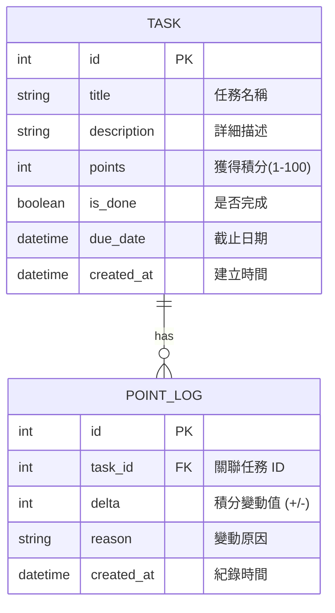

# 資料庫設計文件（DB_DESIGN）

**專案名稱**：TaskFlow — 個人任務管理系統
**文件版本**：v1.0
**建立日期**：2026-04-28
**參考文件**：`docs/PRD.md`、`docs/ARCHITECTURE.md`、`docs/FLOWCHART.md`

---

## 1. ER 圖（實體關係圖）

描述系統中資料實體及其相互關係。



---

## 2. 資料表詳細說明

### 2.1 TASK（任務表）

存儲使用者的所有待辦事項。

| 欄位名稱 | 型別 | 屬性 | 說明 |
|----------|------|------|------|
| id | INTEGER | PK, AI | 唯一識別碼 |
| title | TEXT | NOT NULL | 任務標題（限 100 字元） |
| description | TEXT | NULL | 任務詳細說明 |
| points | INTEGER | DEFAULT 10 | 完成此任務可獲得的積分 |
| is_done | BOOLEAN | DEFAULT 0 | 0:未完成, 1:已完成 |
| due_date | DATETIME | NULL | 任務截止日期 |
| created_at | DATETIME | DEFAULT CURRENT_TIMESTAMP | 建立時間 |

### 2.2 POINT_LOG（積分歷程表）

存儲每次積分的變動明細。

| 欄位名稱 | 型別 | 屬性 | 說明 |
|----------|------|------|------|
| id | INTEGER | PK, AI | 唯一識別碼 |
| task_id | INTEGER | FK | 關聯的任務 ID（刪除任務後保留此 ID 供查詢名稱） |
| delta | INTEGER | NOT NULL | 積分變動值（例如：+10, -10） |
| reason | TEXT | NULL | 變動說明（例如：完成任務 "OOO"） |
| created_at | DATETIME | DEFAULT CURRENT_TIMESTAMP | 紀錄產生的時間 |

---

## 3. SQL 建表語法 (SQLite)

儲存於 `database/schema.sql`。

```sql
-- 建立任務表
CREATE TABLE IF NOT EXISTS tasks (
    id INTEGER PRIMARY KEY AUTOINCREMENT,
    title TEXT NOT NULL,
    description TEXT,
    points INTEGER DEFAULT 10,
    is_done BOOLEAN DEFAULT 0,
    due_date DATETIME,
    created_at DATETIME DEFAULT CURRENT_TIMESTAMP
);

-- 建立積分歷程表
CREATE TABLE IF NOT EXISTS point_logs (
    id INTEGER PRIMARY KEY AUTOINCREMENT,
    task_id INTEGER,
    delta INTEGER NOT NULL,
    reason TEXT,
    created_at DATETIME DEFAULT CURRENT_TIMESTAMP
);
```

---

## 4. Python Model 規劃

依據架構文件，我們使用 **Flask-SQLAlchemy**。

- `app/models/task.py`：定義 `Task` 類別與 CRUD 方法。
- `app/models/point_log.py`：定義 `PointLog` 類別與查詢方法。

---

*文件由 AI Agent (DB Design Skill) 自動產出，請確認欄位定義是否完整。*
