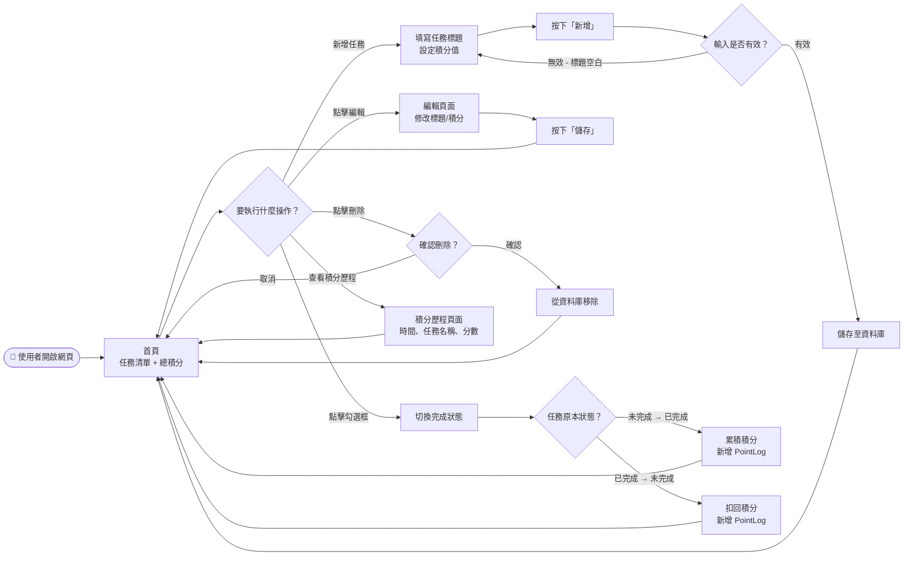
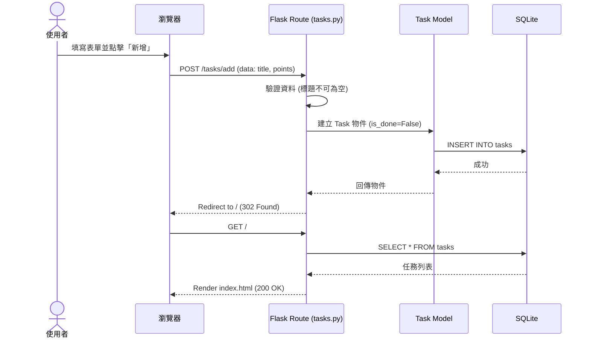
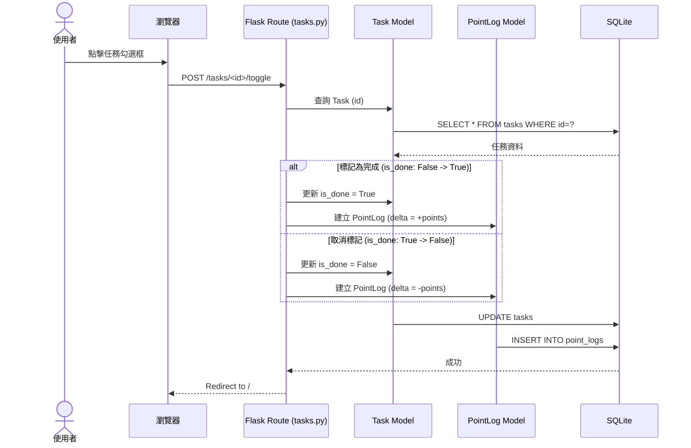

# 流程圖文件（FLOWCHART）

**專案名稱**：TaskFlow — 個人任務管理系統
**文件版本**：v1.0
**建立日期**：2026-04-28
**參考文件**：`docs/PRD.md`、`docs/ARCHITECTURE.md`

---

## 1. 使用者流程圖（User Flow）

描述使用者在系統中的主要操作路徑。

---

## 2. 系統序列圖（Sequence Diagram）

描述「使用者操作」到「資料存入資料庫」的完整資料流。

### 2.1 新增任務流程

### 2.2 切換完成狀態與積分變動

---

## 3. 功能清單對照表

根據架構設計與需求，定義各功能對應的技術細節。

| 功能名稱 | URL 路徑 | HTTP 方法 | 對應模板 (View) | 說明 |
|----------|----------|-----------|-----------------|------|
| 首頁 / 任務列表 | `/` | GET | `index.html` | 顯示所有任務與總積分 |
| 新增任務 | `/tasks/add` | POST | N/A (Redirect) | 處理表單提交，建立新任務 |
| 編輯任務頁面 | `/tasks/<id>/edit` | GET | `edit.html` | 顯示編輯表單 |
| 儲存編輯 | `/tasks/<id>/edit` | POST | N/A (Redirect) | 更新任務內容 |
| 刪除任務 | `/tasks/<id>/delete` | POST | N/A (Redirect) | 刪除任務 (積分歷程保留) |
| 切換完成狀態 | `/tasks/<id>/toggle` | POST | N/A (Redirect) | 切換狀態並記錄積分變動 |
| 積分歷程 | `/points/log` | GET | `point_log.html` | 顯示所有積分變動明細 |

---

*文件由 AI Agent (Flowchart Skill) 自動產出，請審閱流程邏輯是否符合預期。*
