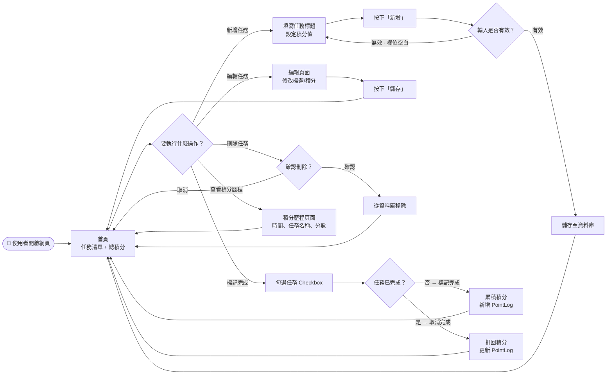
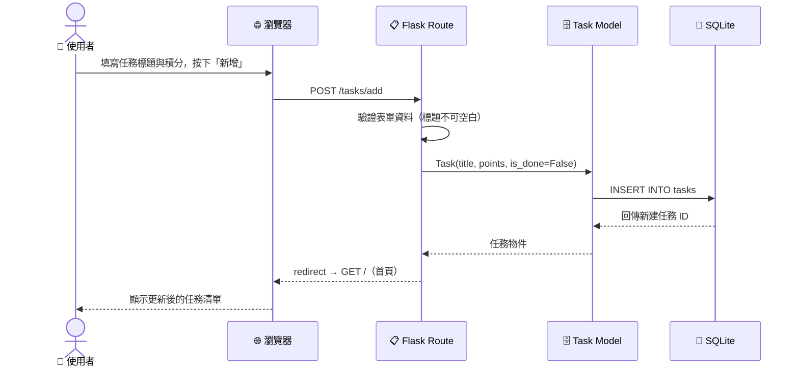
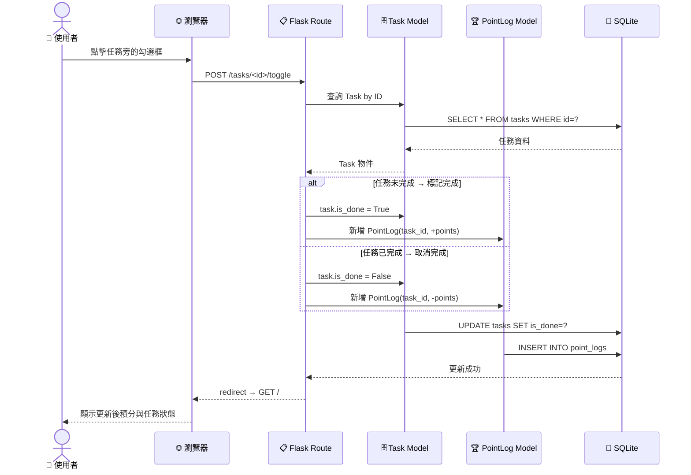
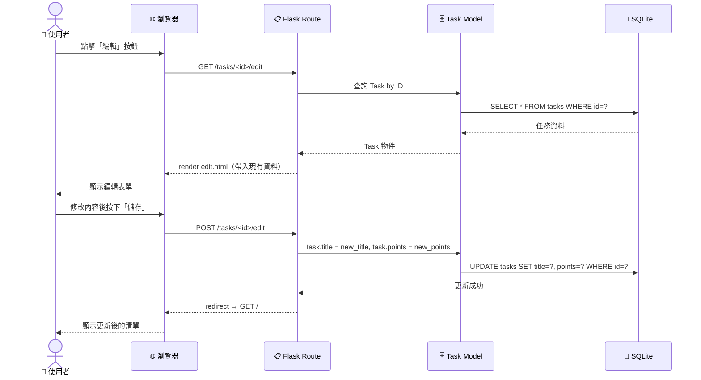
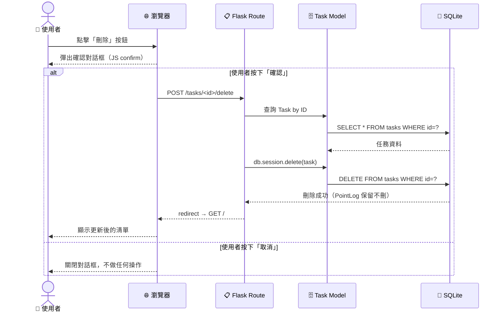
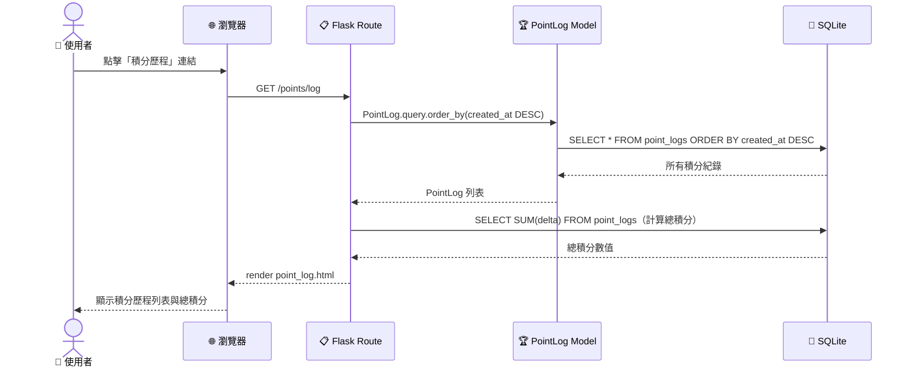

# 流程圖文件（FLOWCHART）

**專案名稱**：TaskFlow — 個人任務管理系統
**文件版本**：v1.0
**建立日期**：2026-04-15
**參考文件**：`docs/PRD.md`、`docs/ARCHITECTURE.md`

---

## 1. 使用者流程圖（User Flow）

描述使用者從進入網站到完成各項操作的完整路徑。

---

## 2. 系統序列圖（Sequence Diagram）

描述各主要功能在系統元件之間的資料流動順序。

### 2.1 新增任務

---

### 2.2 標記任務完成（Toggle）

---

### 2.3 編輯任務

---

### 2.4 刪除任務

---

### 2.5 查看積分歷程

---

## 3. 功能清單對照表

| 功能 | URL 路徑 | HTTP Method | 說明 |
|------|----------|-------------|------|
| 首頁（任務清單） | `/` | GET | 顯示所有任務與目前總積分 |
| 新增任務 | `/tasks/add` | POST | 接收表單，建立新任務 |
| 編輯任務（表單） | `/tasks/<id>/edit` | GET | 顯示帶有現有資料的編輯表單 |
| 儲存編輯 | `/tasks/<id>/edit` | POST | 更新任務標題與積分 |
| 刪除任務 | `/tasks/<id>/delete` | POST | 刪除指定任務（積分歷程保留） |
| 切換完成狀態 | `/tasks/<id>/toggle` | POST | 切換 is_done，並更新積分紀錄 |
| 積分歷程 | `/points/log` | GET | 顯示所有積分變動紀錄 |

---

*文件由 AI Agent（Flowchart Skill）自動產出，請團隊審閱後修改調整。*
